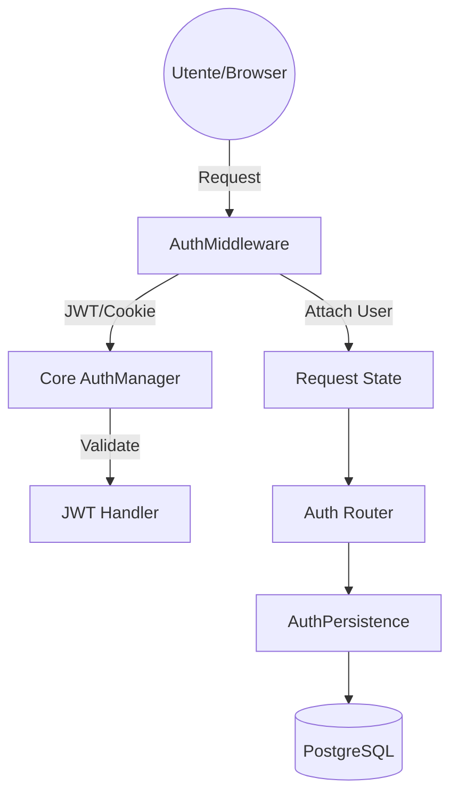
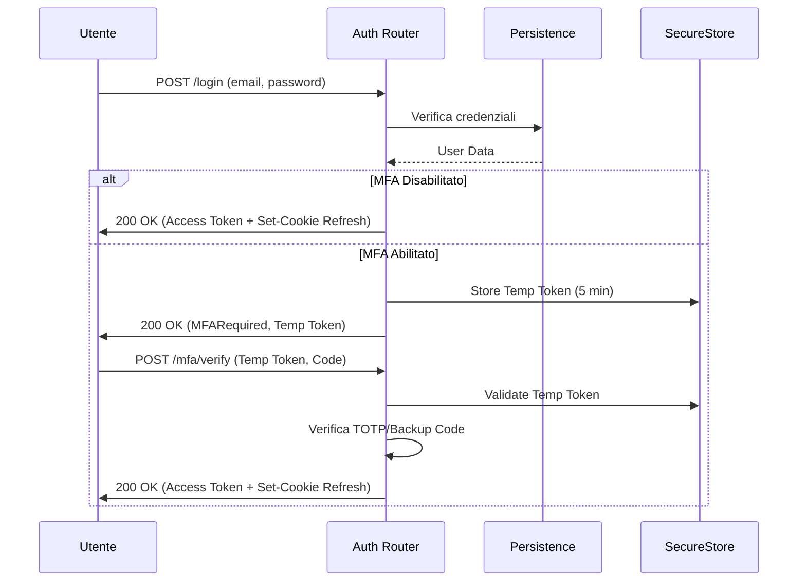
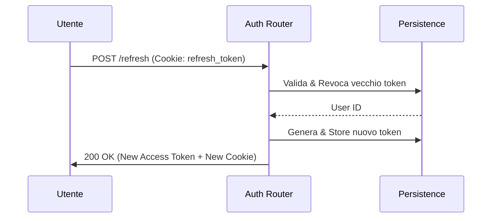
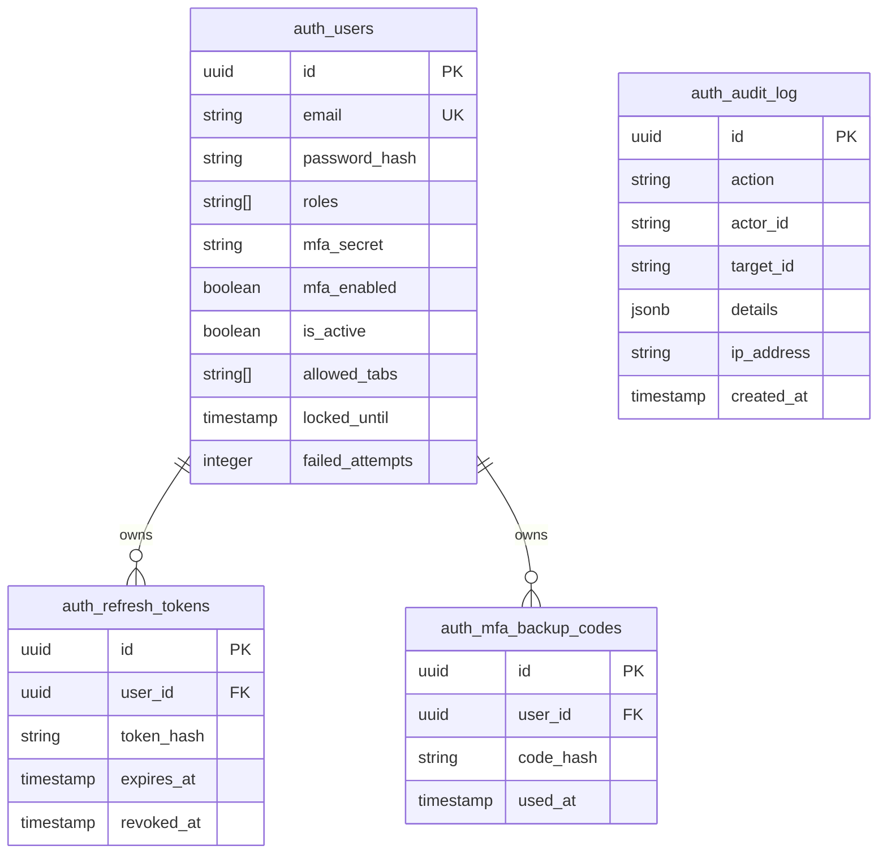

# Auth Plugin - Architettura

Questo documento descrive il design interno, il modello dei dati e i flussi di autenticazione del plugin `auth`.

## Panoramica del Sistema

Il sistema segue un'architettura a plugin plug-and-play, integrandosi con il core del framework tramite middleware e dependency injection di FastAPI.

## Flussi di Autenticazione

### 1. Login e MFA Flow

Il flusso di login supporta l'autenticazione a due fattori (MFA) opzionale. Se l'MFA è abilitato, viene emesso un token temporaneo invece dei token finali.

### 2. Token Refresh Flow

Utilizziamo la rotazione dei refresh token per massimizzare la sicurezza. Ogni volta che un access token viene rinnovato, viene generato un nuovo refresh token e quello vecchio viene invalidato.

## Modello dei Dati

### Database Schema (ERAD)

## Componenti Core

1. **AuthPersistence**: Gestisce tutte le operazioni SQL su PostgreSQL, inclusi utenti, sessioni e audit log.
2. **AuthMiddleware**: Estrattore di identità globale che popola `request.state.user`.
3. **SecureTokenStore**: Gestore in-memoria (con TTL) per i token temporanei della transazione MFA (valutare Redis per multi-istanza).
4. **Redis Rate Limiter**: Sistema di protezione distribuito basato su `fastapi-limiter` per prevenire brute-force.
5. **AdminRouter**: Router dedicato per la gestione utenti e audit, protetto da `require_admin`.
6. **AuditLogger**: Servizio centralizzato per la registrazione immodificabile delle azioni amministrative.
7. **CLI Manager**: Script esterno (`scripts/create_user.py`) per la gestione amministrativa out-of-band e bootstrap.
