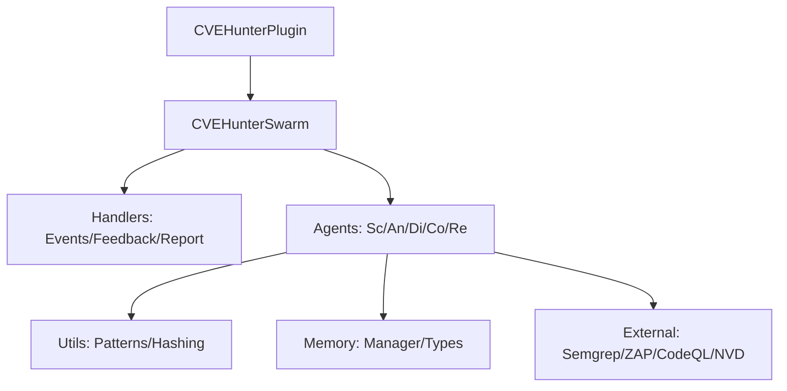

# Plugin CVE Hunter 🛡️

CVE Hunter è uno sciame di agenti AI avanzato progettato per la scansione delle vulnerabilità in tempo reale, l'analisi intelligente, il filtraggio dei falsi positivi e la scoperta di pattern zero-day. Utilizza una moderna dashboard con visualizzazione del grafo in tempo reale e analytics avanzate.

## 🚀 Funzionalità Core & Avanzate

### 🕵️‍♂️ Swarm Intelligence (5 Agenti)

Orchestrazione dinamica basata su **Segnali di Feromone** (Pheromone Signals) e **Allocazione dei Task basata su Asta** (Auction-based Task Allocation):

- 🔍 **Agente Scanner**: Monitoraggio continuo di **NVD (API v2)**, **GitHub Advisories**, **CISA KEV** e **OSV**.
- 🧠 **Agente Analizzatore**: Analisi profonda dell'impatto tramite LLM con **Auto-Correzione** (Self-Correction) e scoring di priorità dinamico.
- 🕵️ **Agente Discovery**: Motore di pattern matching per il rilevamento di vulnerabilità zero-day e anomalie nel codice/testo.
- 🔗 **Agente Correlatore**: Identificazione di **Catene di Attacco** (Attack Chains) complesse e correlazione automatica tra CVE e risultati tramite mapping CWE.
- 📄 **Agente Reporter**: Generazione di report tattici e **Report di Situazione Strategica** in formato Markdown.

### 🛡️ Pipeline SAST/DAST Integrata

Un sistema di scansione completo con loop di feedback:

- **SAST (Analisi Statica)**: Integrazione con **Semgrep** e **CodeQL** per l'analisi del codice locale.
- **DAST (Analisi Dinamica)**: Scansione Web dinamica con **OWASP ZAP** integrato.
- **Risultati Unificati**: Normalizzazione dei risultati da tutte le fonti (Scanner, SAST, DAST, Discovery) in un unico stream pesato per rischio.

### 🧠 Intelligenza e Memoria

- **Experience Replay**: Il sistema impara dai feedback (Confermati/Falsi Positivi) persistiti nella **CVEHunterMemory**.
- **Vector Store (Qdrant)**: Ricerca semantica delle vulnerabilità e gestione degli embeddings per correlazioni avanzate.
- **Feedback Loop Audit**: Registro completo delle decisioni umane e IA per il tuning continuo dei pattern di discovery.

## 🏗️ Architettura Modulare (v2.1)

- **`agents/`**: Parser, Prompter e Scorer isolati e testabili.
- **`swarm/handlers/`**: Logica di gestione Eventi, Feedback e Reporting centralizzata.
- **`memory/`**: Gestione della persistenza strutturata.
- **`utils/`**: Utility per hashing deterministico e pattern di sicurezza.



## ⚙️ Configurazione

```yaml
plugins:
  cve_hunter:
    enabled: true
    scan_interval_minutes: 60
    enable_memory: true
    memory_ttl_days: 30
    discovery:
      confidence_threshold: 0.7
    vector_store:
      enabled: true
      collection: "cve_hunter_cves"
    # Configurazione SAST/DAST
    enable_sast: true
    sast_paths: ["./"]
    enable_dast: true
    dast_targets: ["https://api.myapp.com"]
    # Soglie di Alert
    alert_severity_threshold: "HIGH"
```

## 📡 Integrazione Cross-Plugin (Honeypot)

Il plugin supporta la comunicazione bi-direzionale nativa con il plugin **Honeypot**:

- 📨 **Servizio Lookup CVE**: Risponde agli eventi `honeypot.integration.request_cve_lookup` cercando vulnerabilità correlate ai CWE rilevati. **Scansione on-demand** automatica su cache-miss.
- 📡 **Emissione Eventi**: Invia `cve_hunter.integration.cve_lookup_response` e notifiche proattive `cve_hunter.alert.critical_discovery` per nuovi CVE critici rilevati.
- 🔄 **Feedback Loop**: Sottoscrive `honeypot.integration.correlation_feedback` per migliorare il motore di analisi e correlazione basandosi sulle conferme degli attacchi reali.
- 🔔 **Consapevolezza degli Attacchi**: Sottoscrive gli eventi di attacco (`honeypot.attack.detected`) per loggare e contestualizzare le scansioni.

## 🗄️ Persistenza & Analytics

CVE Hunter ora supporta la persistenza a lungo termine per l'analisi dei trend di vulnerabilità:

- **Database Condiviso**: Utilizza il database PostgreSQL `agent_analytics` (condiviso con Honeypot per analisi correlate).
- **Tabelle**:
    - `cve_definitions`: Archivio arricchito dei CVE rilevati, inclusi CVSS vector, prodotti affetti e riassunti IA.
    - `cve_alerts`: Log storico di tutti gli alert generati dal sistema.
- **Self-Healing**: Crea automaticamente lo schema all'avvio del coordinatore swarm.
- **DAO Pattern**: Logica di persistenza isolata in `persistence.py` per mantenere il core agnostico.

### 🧹 Pulizia Dati (Sviluppo)

Per svuotare il database delle analytics (condiviso con Honeypot) durante lo sviluppo:

```bash
python scripts/reset_analytics_db.py
```

## 📊 Dashboard

La UI dedicata offre:

1. **Grafo dello Sciame Interattivo**: Visualizzazione a 5 nodi con animazioni particellari basate sull'attività reale.
2. **Esploratore delle Catene di Attacco**: Navigazione visuale delle catene di vulnerabilità correlate.
3. **Feed Vulnerabilità Live**: Feed in tempo reale con filtri avanzati (Scanner, Analizzatore, Sistema, Discovery).
4. **Analisi su Richiesta**: Richiesta di analisi immediata per CVE o file specifici.

## 🧪 Test & Qualità

Il plugin mantiene una copertura di test rigorosa:

```bash
# Esegue tutti i test unitari e di integrazione
python -m pytest tests/unit/plugins_tests/cve_hunter/
```

## 📄 Licenza

Parte del **White-Label Agent Framework**. Sviluppato per la massima sicurezza e trasparenza.
