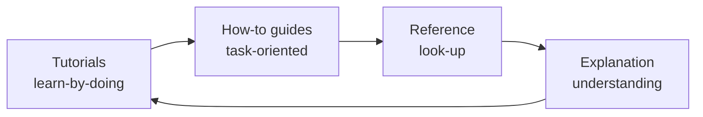

# doCheck Documentation

Entry point della documentazione doCheck. Organizzata secondo [Diátaxis](https://diataxis.fr/).

## Per ruolo

| Ruolo | Inizia da |
|-------|-----------|
| Nuovo sviluppatore | [tutorials/01-first-analysis.md](tutorials/01-first-analysis.md) |
| Operatore / DevOps | [runbooks/setup-dev.md](runbooks/setup-dev.md) |
| Compliance officer | [tutorials/02-author-policy.md](tutorials/02-author-policy.md) |
| Architetto / Security | [explanation/architecture.md](explanation/architecture.md) · [explanation/security-model.md](explanation/security-model.md) |
| API consumer | [api/endpoints.md](api/endpoints.md) · [reference/schemas.md](reference/schemas.md) |
| Auditor / DPO | [explanation/glass-box.md](explanation/glass-box.md) · [runbooks/restore-audit.md](runbooks/restore-audit.md) |

## Tutorials (impara facendo)

Percorsi guidati passo-passo. Pensati per chi parte da zero.

- [01 — Prima analisi end-to-end](tutorials/01-first-analysis.md) — installa, carica un PDF, leggi finding, apri reasoning.
- [02 — Scrivi la tua prima policy](tutorials/02-author-policy.md) — YAML schema, rule lemmas, attiva, riusa.

## How-to guides (esegui task)

Procedure puntuali. Pensate per chi sa cosa vuole fare.

- [setup-dev.md](runbooks/setup-dev.md) — ambiente dev locale.
- [kpi-evaluation.md](runbooks/kpi-evaluation.md) — eseguire eval su test set annotato.
- [deploy-dgx.md](runbooks/deploy-dgx.md) — deploy server DGX Spark con Docker Compose.
- [rotate-keys.md](runbooks/rotate-keys.md) — rotation chiave audit signing.
- [restore-audit.md](runbooks/restore-audit.md) — recovery audit chain dopo incidente.

## Reference (cerca)

Specifica tecnica machine-checkable.

- [api/endpoints.md](api/endpoints.md) — HTTP/WS API completa, RBAC, error codes.
- [reference/schemas.md](reference/schemas.md) — Finding, Report, Policy, AuditEntry contract.
- [reference/config.md](reference/config.md) — env vars `DOCHECK_*` complete.
- [reference/cli.md](reference/cli.md) — comandi `python -m docheck`, scripts/.
- [modules/agents.md](modules/agents.md) · [modules/api.md](modules/api.md) · [modules/audit.md](modules/audit.md) · [modules/events.md](modules/events.md) · [modules/tenant.md](modules/tenant.md)

## Explanation (capisci)

Discussioni concettuali. Pensate per chi vuole capire **perché**.

- [architecture.md](explanation/architecture.md) — overview layered, componenti, deploy targets.
- [agentic-flow.md](explanation/agentic-flow.md) — pipeline LangGraph, fan-out, state, repair retry.
- [glass-box.md](explanation/glass-box.md) — pillar di prodotto, Finding contract, Pydantic guardrails.
- [security-model.md](explanation/security-model.md) — threat model, zero-egress, audit chain, crypto.
- [multitenant.md](explanation/multitenant.md) — tenant context, Postgres RLS, vector isolation.

## Decisioni tecniche

ADR (Architecture Decision Records) numerati. Ogni scelta non banale è giustificata.

- Indice: [adr/](adr/)
- Template per nuovo ADR: [adr/TEMPLATE.md](adr/TEMPLATE.md)

## Spec storiche

[blueprint/](../blueprint/) contiene la specifica enterprise originale (intent + wireframe + prompt templates). Continua a essere fonte autoritativa per design intent. Quando codice e blueprint divergono, il PR descrittivo aggiorna il blueprint o crea un ADR di superamento.

## Stato corrente

[MVP_STATUS.md](MVP_STATUS.md) — checklist cosa è pronto, cosa manca per GA.

## Convention

- Tutti i file source ≤ 500 LOC ([CLAUDE.md §1.1](../CLAUDE.md)).
- Date in formato ISO `YYYY-MM-DD`.
- Path relativi al root del repo.
- Codice in code fence con language hint.
- Decisioni tecniche → ADR; modifiche flusso → blueprint update; runbook ops → `runbooks/`.
