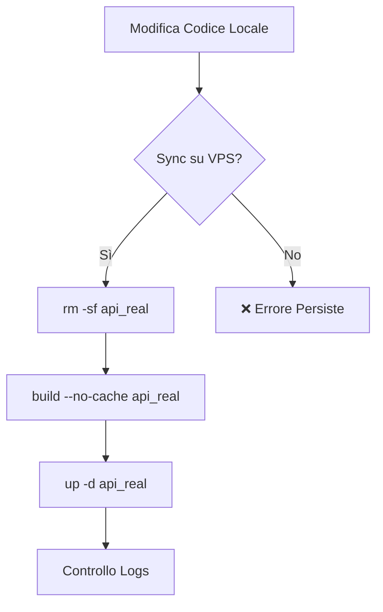
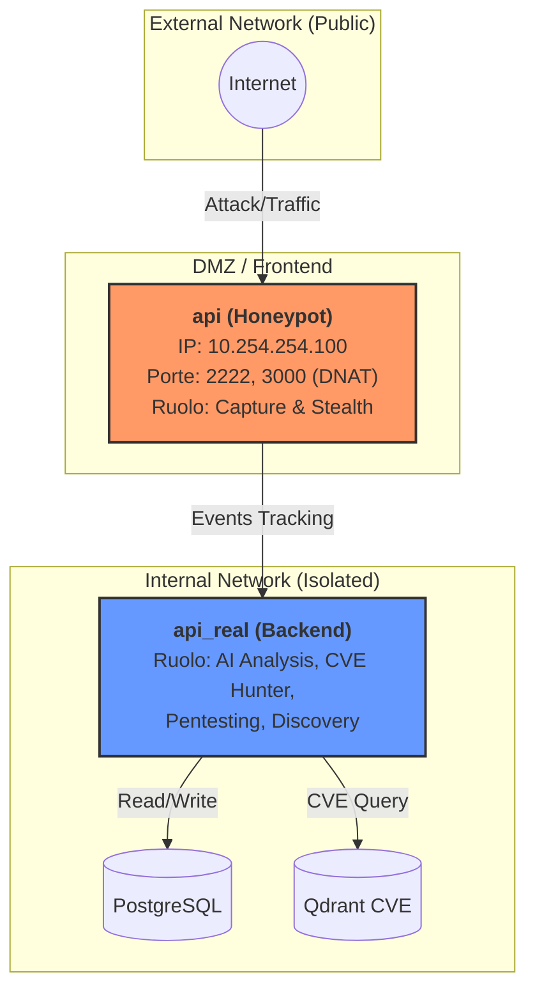

# 🐳 Guida Docker & VPS per Honeypot

Questa guida copre le operazioni comuni per la gestione del plugin Honeypot in ambienti di produzione (VPS).

## 🔄 Aggiornamento e Rebuild

### Problema: Le modifiche al codice non appaiono in produzione

Se hai modificato il codice Python (es. fix di un bug backend) e l'errore persiste sul server VPS anche dopo `docker compose restart`, il problema è quasi sempre la **cache di Docker**.

Docker compose non ricostruisce le immagini se il `Dockerfile` non è cambiato, anche se i file copiati al suo interno sono stati modificati.

### Soluzione: Clean Rebuild

Per forzare l'aggiornamento del codice nel container, esegui questi comandi:



```bash
# 1. Ferma e rimuovi il container specifico (es. api_real)
docker compose -f docker-compose-prod-v3.yml rm -sf api_real

# 2. Ricostruisci forzando il download e ignorando la cache (CRITICO)
docker compose -f docker-compose-prod-v3.yml build --no-cache api_real

# 3. Avvia il servizio aggiornato
docker compose -f docker-compose-prod-v3.yml up -d api_real
```

### Verifica

Dopo il riavvio, controlla i log per assicurarti che il servizio sia partito pulito:

```bash
docker compose -f docker-compose-prod-v3.yml logs -f --tail=100 api_real
```

---

## 🏗️ Architettura VPS (Split-Container)

In produzione, il plugin Honeypot utilizza due container separati per sicurezza:



1. **`api` (Honeypot)**:
    * Esposto pubblicamente **SOLO** via DNAT (vedi `honeypot_firewall.sh`).
    * Isolato dalla rete del database (`postgres_backend_net`).
    * Esegue solo la cattura degli attacchi.

2. **`api_real` (Backend Core)**:
    * NON esposto pubblicamente.
    * Connesso al database PostgreSQL e Vector Store.
    * Esegue la logica di business: correlazione CVE, analisi Discovery, Pentesting, API Dashboard.

### Configurazione `plugins-honeypot.yaml`

Assicurati che il file `configs/plugins-honeypot.yaml` montato nel container `api` sia configurato correttamente per delegare le operazioni complesse:

```yaml
honeypot:
  enabled: true
  enable_cve_correlation: true  # Usa Qdrant (accessibile)
  cve_hunter:
    enabled: false              # Disabilitato qui, gira su api_real
```

---

## 🛠️ Comandi Utili

### Riavvio Completo dello Stack

```bash
docker compose -f docker-compose-prod-v3.yml down
docker compose -f docker-compose-prod-v3.yml up -d --build
```

### Reset del Database (Attenzione!)

Se devi pulire tutti i dati per ripartire da zero:

```bash
# Entra nel container worker o api_real
docker compose -f docker-compose-prod-v3.yml exec api_real bash

# Esegui lo script di reset
python scripts/reset_all.py
```
