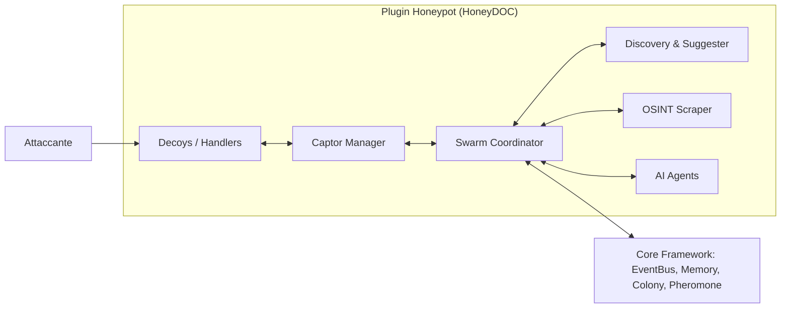
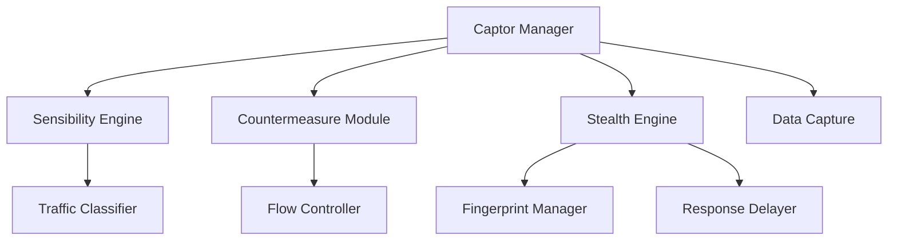
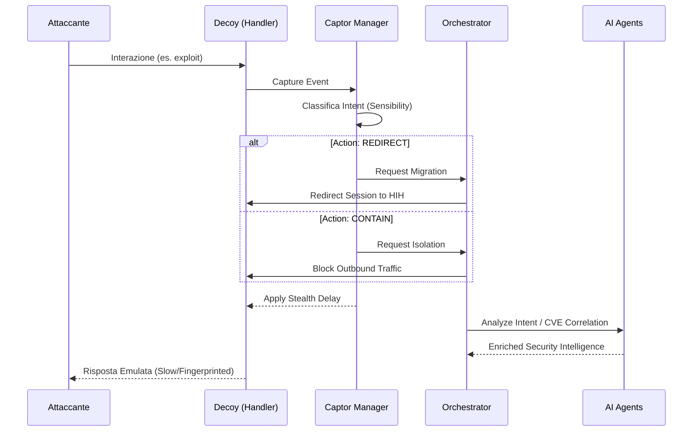

# Architettura del Plugin Honeypot (HoneyDOC)

Questo documento descrive l'architettura avanzata del plugin Honeypot, integrato secondo i principi del framework **HoneyDOC** (Decoy, Captor, Orchestrator).

## Panoramica

L'architettura è progettata per essere modulare, stealth e capace di gestire contromisure dinamiche in risposta agli attacchi rilevati. Si basa su tre pilastri fondamentali:



1. **Decoy (Esca)**: Le istanze di honeypot reali (SSH, HTTP, TCP) che interagiscono con l'attaccante.
2. **Captor (Catturatore)**: Il sistema di monitoraggio, analisi e controllo del traffico.
3. **Orchestrator (Orchestratore)**: Il coordinatore centrale che gestisce il ciclo di vita e la logica di business.

---

## 1. Orchestrator (`HoneypotSwarmCoordinator`)

L'Orchestratore risiede in `plugins/honeypot/swarm/coordinator.py`. Agisce come punto centrale di controllo e compone le funzionalità tramite diversi mixin:

- **LifecycleMixin**: Gestisce l'avvio, l'arresto e l'inizializzazione delle integrazioni.
- **AttackProcessorMixin**: Elabora gli eventi di attacco in modo ultra-veloce tramite un sistema di **Async Updates** e **Batch Persistence** (latenza ridotta del 95%).
- **StatsMixin**: Aggrega statistiche, gestisce il registro degli honeypot e fornisce dati filtrati.
- **HandlersMixin**: Carica e gestisce gli handler di protocollo dinamici.
- **Scalability Protocol**: Implementa il coordinamento tra il buffer in memoria (fino a **100K eventi**) e il Persistence Layer ottimizzato.

---

## 2. Captor Module (`plugins/honeypot/captor/`)

Il Captor è il "cuore senziente" del sistema. È orchestrato dal `CaptorManager` e comprende:



### A. Sensibility (Sensibilità)

Responsabile del rilevamento e della classificazione fine del traffico (`classification.py`).

- **TrafficClassifier**: Valuta il traffico in base a regole Snort-style.
- **Azioni**: Determina se il traffico deve essere **DROP** (scartato), **FORWARD** (inoltrato normalmente) o **REDIRECT** (ridiretto a un'esca ad alta interazione - HIH).

### B. Countermeasure (Contromisure)

Gestisce le risposte attive agli attacchi (`countermeasures/`).

- **FlowController**: Gestisce il blocco degli IP (Auto-blocking), l'isolamento delle sessioni e la redirezione.
- **DynamicDeployer**: Permette il provisioning dinamico di nuove esche o la riconfigurazione di quelle esistenti in runtime.

### C. Stealth (Furtività)

Garantisce che il sistema rimanga invisibile agli attaccanti (`stealth.py`).

- **Fingerprint Consistency**: Assicura che tutte le esche presentino la stessa impronta digitale (OS, versioni software).
- **Transparent Session Handling**: Gestisce i ritardi nelle risposte (`apply_stealth_delay`) e maschera gli header Python per evitare il rilevamento dell'emulazione.

---

## 3. Flusso di Elaborazione di un Attacco



1. **Interazione**: Un attaccante interagisce con un handler (es. `SSHHandler`).
2. **Cattura**: L'evento viene inviato al `DataCaptureManager`.
3. **Classificazione**: Il `TrafficClassifier` analizza il payload.
4. **Decisione**: L'Orchestratore applica l'azione (es. se l'attacco è critico, attiva la redirezione).
5. **Analisi**: Gli agenti specializzati (`LLMResponder`, `PatternAnalyzer`, `CVECorrelator`) analizzano l'intento e le vulnerabilità correlate.
6. **Persistenza**: I dati vengono salvati nella memoria a lungo termine (`AgentMemory`) per aggiornare la reputazione degli IP.

---

## 4. Integrazione LLM

Il sistema utilizza modelli linguistici (LLM via `Ollama` o `OpenAI`) per:

- Generare risposte realistiche nei terminali SSH e HTTP.
- Analizzare l'intento dell'attaccante.
- **Red Team Strategy**: Generare mutazioni intelligenti d'attacco e offuscamento dinamico (AIPoweredFuzzer) per testare la compliance del sistema.
- Migliorare la profondità dell'emulazione, rendendo l'esca indistinguibile da un sistema reale.

La sicurezza di tali interazioni è garantita dal layer **LLM Guardrails**, che implementa:

- **Immutable System Prompts**: Regole di sicurezza che prevalgono su qualsiasi input.
- **Instruction Hierarchy**: Gestione rigorosa delle priorità per prevenire prompt injection.
- **Output Filtering**: Mascheramento dinamico di segreti e leak di configurazione.

---

## 5. Directory Structure

```text
plugins/honeypot/
├── captor/              # Modulo Captor (HoneyDOC)
│   ├── manager.py       # Orchestrazione Captor
│   ├── classification.py # Sensibility
│   ├── stealth.py        # Stealth features
│   └── countermeasures/  # Strategie di risposta
├── engine/              # Handler di protocollo (SSH, HTTP, TCP)
│   └── iot/             # [NUOVO] Handler IoT/OT (Modbus, MQTT, S7comm)
├── routes/              # API Endpoints (FastAPI)
│   └── analytics.py     # [NUOVO] Endpoints per trend e serie temporali
├── swarm/               # Coordinazione Orchestrator (Mixins)
├── persistence/         # Strato di persistenza modulare
│   ├── retention.py     # [NUOVO] Data retention logic
│   ├── timeseries.py    # [NUOVO] Time-bucketed aggregates
│   └── aggregations.py  # [NUOVO] Advanced analytics queries
├── discovery/           # Modulo Discovery (Botnet & C&C Detection)
│   ├── graph_analyzer.py # Analisi dei grafi (NetworkX)
│   ├── correlation_analyzer/ # Correlazione avanzata TTP/Timing
│   ├── botnet_detector/  # Hub identification & Weighted Scoring
│   └── honeypot_suggester/ # Smart Recommendations [NUOVO]
├── scraper/             # Modulo OSINT (BaselithCore) [NUOVO]
└── agents/              # Agenti AI (Pattern analysis, CVE Correlation)
```

---

## 6. Deployment in Produzione

Con l'evoluzione della configurazione `docker-compose-prod-v3.yml`, l'architettura dell'honeypot segue un modello **Hybrid-Isolated**:

- **Decoupling Network**: L'honeypot viene eseguito in un'istanza dedicata (`api`) separata dall'API reale (`api_real`), garantendo che un eventuale compromise del container honeypot non esponga il sistema di gestione interna.
- **Database Dedicato**: L'honeypot utilizza il database PostgreSQL `agent_analytics` per memorizzare eventi e sessioni, isolato dal database principale dell'applicazione.
- **Accesso ai Servizi di Sicurezza**:
    - **Ollama**: L'istanza è connessa alla rete `ai_net` per accedere a Ollama e generare risposte realistiche via LLM.
    - **Qdrant**: L'istanza è connessa a `qdrant_backend` per la **CVE Correlation** in tempo reale, mappando gli attacchi alle vulnerabilità note scaricate dal CVE Hunter.
- **Configurazione Granulare**: Utilizza un file di configurazione dedicato `configs/plugins-honeypot.yaml` che disabilita i plugin non necessari (come lo scanner CVE Hunter) per ridurre il rumore e i consumi.
- **Isolamento di Rete**: L'honeypot risiede nella rete `honeypot_net` per gestire il traffico in ingresso, ma è isolato dalle reti dei database sensibili (`postgres_backend_net`, `falkordb_backend_net`).
- **Hardening**: Filesystem in sola lettura (`read_only: true`), capacità rimosse (`cap_drop: ALL`) e temporary filesystem per gli handler.
