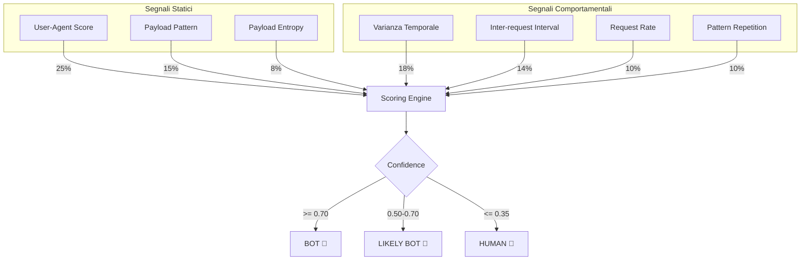

# Sistema di Rilevamento Bot (Bot Detection)

Questo documento descrive il sistema di analisi comportamentale e statico utilizzato dal plugin Honeypot per distinguere tra attaccanti umani e bot/script automatizzati.

## Panoramica

Il sistema utilizza un approccio ibrido che combina:

1. **Analisi Statica (Single-Request)**: User-Agent, pattern del payload, header fingerprinting.
2. **Analisi Comportamentale (Multi-Request)**: Timing, varianza, frequenza, ripetizione.

Questo permette di identificare sia bot persistenti (tramite comportamento) che scanner "one-shot" (tramite fingerprint).

### Componenti Principali

1. **`BotDetector` (`engine/bot_detector.py`)**: Motore di analisi.
2. **Static Patterns**: Liste di User-Agent e pattern regex per identificazione immediata.
3. **Integrazione Handlers**: Estrazione automatica di metadati (es. User-Agent) dagli eventi.

---

## Metodologia di Analisi

Il punteggio finale (Confidence) è una somma pesata di 7 segnali:

| Segnale | Peso | Tipo | Descrizione |
| :--- | :--- | :--- | :--- |
| **User-Agent Analysis** | 25% | Statico | Analizza lo User-Agent contro una lista di bot noti (curl, wget, scanner). |
| **Payload Pattern** | 15% | Statico | Cerca pattern di attacco automatizzato (fuzzing, SQLi massivi). |
| **Payload Entropy** | 8% | Statico | Bassa entropia indica comandi ripetitivi/scriptati. |
| **Timing Variance** | 18% | Comportamentale | Bassa varianza (<50ms) indica automazione precisa. |
| **Inter-Request Interval** | 14% | Comportamentale | Intervalli troppo brevi (<50ms) indicano script. |
| **Request Rate** | 10% | Comportamentale | Alto tasso di richieste al minuto. |
| **Pattern Repetition** | 10% | Comportamentale | Ripetizione identica di payload multipli. |

> **Nota**: I segnali statici (48% del peso totale) permettono una classificazione efficace già dalla **prima richiesta**.

---

## Logica di Classificazione

La confidenza è un valore `0.0 - 1.0`.

- **BOT** (`confidence >= 0.70`): Forte certezza di automazione (es. User-Agent curl + scansione veloce).
- **LIKELY BOT** (`0.50 < confidence < 0.70`): Sospetto, ma dati non conclusivi.
- **LIKELY HUMAN** (`0.35 < confidence <= 0.50`): Comportamento probabilmente umano.
- **HUMAN** (`confidence <= 0.35`): Alta varianza, tempi umani, User-Agent browser standard.
- **UNKNOWN**: Nessun segnale disponibile (raro con la nuova analisi statica).

---

## Esempio di Risultato (JSON)

I dati sono salvati nel campo `is_bot` (booleano semplificato) e `bot_signals` (dettagli) dell'evento.

```json
{
  "is_bot": true,
  "bot_confidence": 0.85,
  "bot_classification": "bot",
  "bot_signals": {
    "user_agent_score": 1.0,
    "payload_pattern_score": 0.0,
    "timing_variance": 0.0,
    "request_rate_per_minute": 120.0,
    "inter_request_interval_ms": 45.0
  },
  "reason": "Known Bot User-Agent; Ultra-fast requests (45ms)"
}
```

## Architettura del Punteggio


