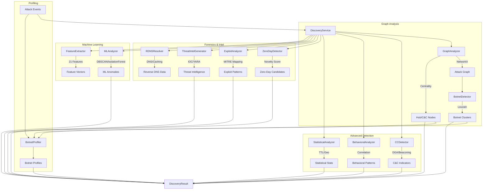
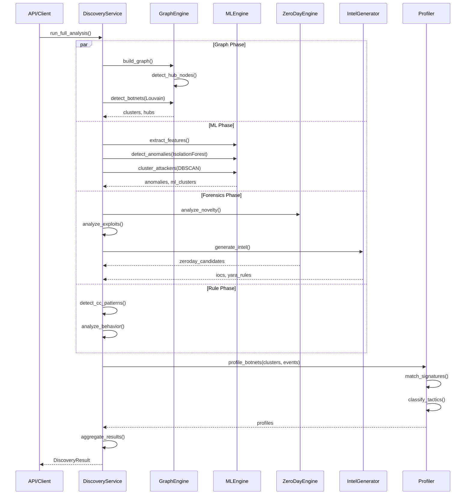

# 🕵️ Discovery Module - Botnet & Threat Detection

Il modulo **Discovery** potenzia l'honeypot con capacità avanzate di rilevamento botnet, identificazione C&C, analisi comportamentale basata su ML e Threat Intelligence automatizzata.

---

## 🏗️ Architettura

Il modulo è strutturato in componenti specializzati che analizzano gli eventi di attacco in parallelo e sequenza.



---

## 🧩 Componenti

Il modulo è stato recentemente **modularizzato in package** per massimizzare la scalabilità e facilitare l'aggiunta di nuovi motori di analisi.

### 1. Graph Analysis (`graph_analyzer.py` & `botnet_detector/`)

Costruisce un grafo delle interazioni (Attaccante -> Honeypot) e applica algoritmi di teoria dei grafi avanzati.

- **Botnet Detection**: Usa l'algoritmo di **Louvain** per identificare "community" di attaccanti coordinati basandosi sulla densità delle connessioni.
- **Precision C&C Identification**: Rileva nodi centrali (potenziali Command & Control) utilizzando criteri rigorosi:
    - **Adaptive Thresholds**: I minimi di connessione (degree) si adattano all'attività globale del grafo (es. minimo 5 connessioni o 2x la media).
    - **Centrality Metrics**: Combina **Degree Centrality** e **Betweenness Centrality** per identificare i "ponti" tra diverse botnet.
    - **Weighted Threat Scoring**: Ogni hub riceve uno score 0-100 calcolato su pesi configurabili (`centrality`, `degree_ratio`, `cross_cluster_connections`, `multi_honeypot_targeting`).

### 2. Attacker Correlation (`discovery/correlation_analyzer/`) [NUOVO]

Un motore dedicato alla correlazione cross-attaccante che identifica legami invisibili tra diversi IP. Questo modulo arricchisce il grafo con archi "attaccante-attaccante".

- **Timing Correlation**: Rileva IP che colpiscono lo stesso target entro una finestra temporale standard di **60 secondi** (indicatore di coordinamento botnet).
- **Pattern Matching (TTPs)**: Calcola la similarità di Jaccard (threshold ≥ 0.7) tra i comandi e i payload eseguiti da diversi IP.
- **Cross-Honeypot Targeting**: Identifica IP che targettano sistematicamente 2 o più honeypot diversi, indicando una scansione infrastrutturale organizzata.
- **Infrastructure Correlation**: Rileva cluster di IP provenienti dallo stesso subnet (es. /24) o ASN, identificando infrastrutture di attacco condivise.

### 3. C&C Detection (`cc_detector/`)

Tecniche specifiche per infrastrutture di Comando e Controllo.

- **DGA Detection**: Analisi entropica dei domini richiesti.
- **Beaconing Analysis**: Rilevamento di "heartbeat" periodici (trasformata o analisi intervalli).
- **Fast-Flux**: Identificazione di domini che ruotano rapidamente IP.

### 4. Machine Learning (`ml_analyzer/`)

Analisi non supervisionata e rilevamento anomalie.

- **Clustering (DBSCAN)**: Raggruppa attaccanti per feature vettoriali.
- **Anomaly Detection (Isolation Forest)**: Identifica outlier statistici (es. attacchi APT).
- **Time Series**: Rileva "burst" anomali di traffico (z-score).

### 5. Botnet Profiling (`botnet_profiler/`)

Attibuisce identità e intenzioni ai cluster rilevati.

- **Malware Identification**: Database di firme per **Mirai, Emotet, Qakbot, Cobalt Strike**, etc.
- **Tactic Classification**: DDoS, Cryptomining, Brute-force, Espionage.
- **Size Estimation**: Classificazione (Micro -> Massive).

### 6. Feature Engineering (`feature_extractor/`)

Estrae vettori numerici (21 dimensioni) per ogni IP.

- **Temporal**: Frequenza, burstiness, peak hour.
- **Payload**: Entropia, dimensione media.
- **Network**: Fingerprint protocolli/porte.
- **Statistical**: Rapporto caratteri speciali, pattern hex.

### 7. Zero-Day Detection (`zeroday_detector/`)

Identifica minacce sconosciute che sfuggono alle firme tradizionali.

- **Signature Gap Analysis**: Analizza payload che non matchano CVE noti ma hanno caratteristiche di exploit.
- **Novelty Scoring**: Assegna un punteggio di unicità (0-1) basato sulla deviazione dallo storico.
- **Obfuscation Detection**: Rileva tecniche di evasione come encoding multipli, packing, o shellcode polimorfico.
- **Attack Vector Identification** [NUOVO]: Identifica automaticamente il vettore (es. RCE, SQLi, Buffer Overflow) anche per vulnerabilità novelty.

### 8. Exploit Analysis (`exploit_analyzer/`)

Classifica la sofisticazione e la metodologia dell'attacco.

- **MITRE ATT&CK Mapping**: Associa i pattern rilevati alle tecniche TTP standard (es. T1210 - Exploitation of Remote Services).
- **Attack Chain Recognition**: Riconosce attacchi multi-fase (es. Recon -> Exploit -> Persistence).
- **Sophistication Score**: Valuta la complessità tecnica dell'attaccante.

### 9. Threat Intelligence (`threat_intel/`)

Genera intelligence azionabile dagli attacchi rilevati. Strutturato come package modulare (`core.py`, `extractors.py`, `yara.py`).

- **IOC Extraction**: Estrae automaticamente IP, Domini, URL e Hash di file malevoli.
- **YARA Rule Generation**: Crea regole YARA dinamiche per nuovi payload identificati come malevoli.
- **Scoring Engine**: Calcola il threat score degli artefatti in base a reputazione e virulenza.
- **STIX Export**: Supporta l'esportazione dei dati nel formato standard STIX 2.1 per la condivisione.

---

## 🔄 Flusso di Analisi



---

### 10. Weighted Threat Scoring (C&C Verification)

Il sistema assegna un punteggio di precisione (0-100) per identificare i nodi C&C confermati, riducendo i falsi positivi tramite pesi bilanciati:

| Metrica | Peso Max | Descrizione |
|---------|----------|-------------|
| **Centrality** | 30.0 | Media di Degree e Betweenness Centrality. |
| **Degree Ratio** | 25.0 | Numero di connessioni rispetto alla media degli attaccanti. |
| **Cross-Cluster** | 15.0 | Capacità di agire come "bridge" tra diverse botnet. |
| **Multi-Honeypot** | 15.0 | Bonus per aver targettato honeypot geograficamente o tecnicamente diversi. |
| **Correlation Bonus** | 10.0 | Bonus basato sul numero di altri attaccanti correlati (coordinamento). |
| **Leader Bonus** | 10.0 | Bonus se il nodo è il leader (highest degree) della sua community. |

> [!NOTE]
> Un nodo con score ≥ **70.0** viene classificato come **Confirmed C&C** e attiva automaticamente le procedure di auto-discovery per il Red Team.

---

## 📊 Modello Dati

Il risultato dell'analisi (`DiscoveryResult`) aggrega tutte le informazioni:

```json
{
  "botnets": [
    {
      "id": "cluster_0",
      "size": 15,
      "main_target": "ssh-honeypot",
      "confidence": 0.85,
      "malware_family": "Mirai",
      "tactics": ["brute_force", "command_injection"]
    }
  ],
  "hub_nodes": [
    {
      "ip": "192.168.1.100",
      "type": "cnc_candidate",
      "score": 0.92
    }
  ],
  "anomalies": [
    {
      "ip": "10.0.0.5",
      "type": "zeroday_candidate",
      "severity": "critical",
      "metadata": {
        "novelty_score": 0.98,
        "attack_vector": "remote_code_execution",
        "pattern_type": "buffer_overflow"
      }
    }
  ],
  "summary": {
    "high_severity_clusters": 2,
    "zeroday_detection": {
        "zeroday_candidates": 3
    },
    "exploit_patterns": {
        "mitre_techniques": ["T1190", "T1059"]
    },
    "threat_intel": {
        "ioc_count": {"ips": 12, "domains": 5, "hashes": 2},
        "yara_rules_generated": 1
    }
  }
}
```

---

## 🎯 Integrazione con Red Team (Auto-Discovery)

Il modulo Discovery funge da "occhio" per il modulo Red Team, fornendo intelligence in tempo reale sui target più vulnerabili o sotto attacco attivo.

### Flusso di Auto-Discovery

1. **Rilevamento Hub**: Il `BotnetDetector` identifica i nodi centrali (Hub) dell'attacco.
2. **Scoring**: `DiscoveryService` assegna un `threat_score` basato sulla magnitudo dell'attacco e sulla criticità (es: C&C confermati).
3. **Signal to Pentester**: Tramite l'API `/targets/discover`, il modulo Pentest interroga questi risultati.
4. **Auto-Registration**: I nodi con score > 70 vengono registrati automaticamente come target per campagne di validazione (pentesting) per verificare la resilienza degli agenti reali che quel nodo sta cercando di emulare o attaccare.

---

## 🛠️ Utilizzo API

L'analisi può essere avviata on-demand o pianificata:

- **POST** `/discovery/analyze`: Avvia un'analisi completa (può richiedere secondi/minuti).
- **GET** `/discovery/graph`: Ottiene i dati (nodi/archi) per la visualizzazione.
- **GET** `/discovery/summary`: Statistiche di alto livello sui rilevamenti.
- **GET** `/discovery/rdns`: Enrichment Reverse DNS asincrono con caching e scoring di importanza.

## 📦 Dipendenze

Per abilitare tutte le funzionalità ML avanzate:

```bash
pip install networkx python-louvain scikit-learn numpy ssdeep
```

*Nota: Il sistema fallbacka graziosamente su algoritmi euristici se scikit-learn o ssdeep non sono disponibili.*

---

## 💡 Honeypot Suggester (`honeypot_suggester/`)

Il **Suggester Engine** è un modulo di intelligenza proattiva che analizza i pattern di attacco non coperti dagli honeypot attuali e suggerisce la creazione di nuove esche dedicate.

### Logica di Suggerimento

Il motore analizza tre flussi di dati principali per generare suggerimenti:

1. **Zero-Day Candidates**: Pattern di attacco con alta `novelty_score` (≥ 0.65) che non corrispondono a CVE noti.
2. **Behavioral Clusters**: Gruppi coordinati di attaccanti (≥ 4 membri) che eseguono comandi simili.
3. **Protocol Anomalies**: Traffico su porte non gestite o protocolli sconosciuti con alta confidenza.

### Criteri di Ranking

Ogni suggerimento viene valutato e prioritizzato in base a:

| Metrica | Descrizione |
|---------|-------------|
| **Novelty** | Quanto è unico il pattern rispetto allo storico. |
| **Persistence** | Frequenza dell'attacco (min. 4 occorrenze richieste). |
| **Coordination** | Numero di IP unici coinvolti nell'attacco. |
| **Impact** | Severità potenziale stimata dagli indicatori di attacco. |

### Output

Il sistema genera oggetti `HoneypotSuggestion` che includono:

- **Rationale**: Spiegazione dettagliata del *perché* questo honeypot è necessario.
- **Detection Patterns**: Regole regex generate automaticamente per rilevare l'attacco.
- **Suggested Configuration**: Protocollo (SSH/HTTP/TCP) e porta consigliata.
- **Estimated Catch Rate**: Stima dell'efficacia basata sui dati storici.
