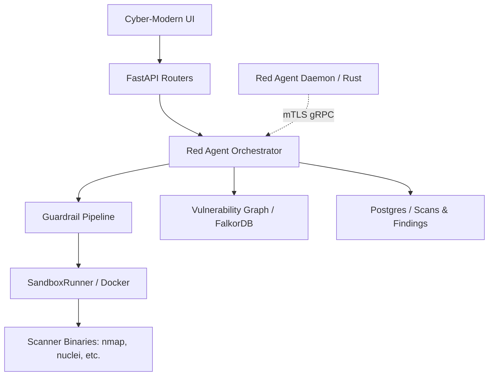

# Red Agent Plugin

Autonomous Red Team agent for proactive security scanning (recon, DAST,
SCA) with graph-based vulnerability mapping and on-host telemetry via a
Rust endpoint daemon.

## Status

- **Server-side orchestrator + UI** — production-ready (scans, findings,
  graph, fleet, host targets, signed-policy bundle issuance).
- **Endpoint daemon (Rust)** — Phase 1 / MVP **shipped as `v0.1.0`**.
  Pinned-root mTLS 1.3 transport, ed25519 enrollment + persistent
  identity keystore, signed policy bundle verifier, sandboxed local
  scanner executor. End-to-end mTLS regression test plus dev compose
  smoke stack land in this repo (see [daemon/](daemon/) and
  [daemon/CHANGELOG.md](daemon/CHANGELOG.md)).
- **Phase 2** (eBPF / ESF / NATS / self-update) — planned, see
  [docs/agent_daemon.md §10](docs/agent_daemon.md#10-roadmap).

## Overview

The **Red Agent** is an enterprise-grade security plugin for
BaselithCore. It automates reconnaissance and vulnerability scanning
against authorized targets, materializing the discovered attack surface
into a queryable property graph in **FalkorDB**, and extends scan
coverage to customer endpoints through an installable Rust daemon that
talks to the backend over a single pinned-root mTLS gRPC stream.

### Key Components

- **Orchestrator (Python)**: Manages the scan lifecycle, planning, and
  integration with the BaselithCore storage and audit tiers.
- **Endpoint Daemon (Rust)**: Lightweight static binary (~10 MB RAM
  idle) deployed on target hosts. Single outbound TLS 1.3 connection,
  never listens. Source under [daemon/](daemon/), wire schema in
  [proto/agent.proto](proto/agent.proto).
- **Scanner Adapters**: Interfaces for industry-standard tools like
  `nmap`, `nuclei`, `zap`, `sqlmap`, and `trivy` — runnable
  backend-side in Docker sandbox or daemon-side under landlock /
  sandbox-exec.
- **Guardrail Pipeline**: Strict security enforcement to prevent SSRF
  and out-of-scope scanning.
- **Fleet UI**: React tab listing enrolled daemons, status, recent
  telemetry, and the enrollment-token generator. The "Host" target
  kind in the New Target wizard binds a target to an enrolled daemon
  for on-host scanning.

## Architecture



See [ARCHITECTURE.md](ARCHITECTURE.md) for a detailed breakdown of the internal components and data flow.

## Design Principles

The plugin is built on the following tenets:

- **Adaptive Reasoning**: Uses `AttackPlanner` to chain scans based on previous findings.
- **Context-Aware**: Links vulnerabilities to cloud and identity context in the graph.
- **Validated Impact**: Can be configured to filter out noise and focus on proven exploitable risks.
- **Sandbox-First**: Every scanner binary runs in a hardened Docker container.

See [PRINCIPLES.md](PRINCIPLES.md) for more details.

## Installation & Setup

### Prerequisites

- **PostgreSQL**: For persistent storage of scans, findings, and audit logs.
- **FalkorDB**: For the attack-surface property graph.
- **Redis**: For scan status pub/sub and idempotency.
- **Docker**: For sandboxed scanner execution.

### Configuration

Configure the plugin via environment variables (prefixed with `RED_AGENT_`):

| Variable                            | Default  | Description                                           |
| ----------------------------------- | -------- | ----------------------------------------------------- |
| `RED_AGENT_SCOPE_ALLOWLIST`         | `[]`     | Authorized domains/IPs/CIDRs.                         |
| `RED_AGENT_BUG_BOUNTY_MODE`         | `false`  | If true, delegates scope check to bug-bounty program. |
| `RED_AGENT_REQUIRE_HITL_FOR_ACTIVE` | `true`   | Require human approval for intrusive scans.           |
| `RED_AGENT_MAX_CONCURRENT_SCANS`    | `4`      | Max parallel scans.                                   |
| `RED_AGENT_SANDBOX_PROVIDER`        | `docker` | `docker` or `sbx`.                                    |
| `RED_AGENT_GRPC_ENABLED`            | `false`  | Enable gRPC server for endpoint daemons.              |
| `RED_AGENT_GRPC_BIND_HOST`          | `0.0.0.0`| Bind host for the daemon-facing gRPC server.          |
| `RED_AGENT_GRPC_BIND_PORT`          | `50443`  | Bind port for the daemon-facing gRPC server.          |
| `RED_AGENT_CA_CERT_PATH`            | unset    | PEM path of the agent CA cert (signs daemon certs).   |
| `RED_AGENT_CA_KEY_PATH`             | unset    | PEM path of the ed25519 PKCS#8 CA private key.        |
| `RED_AGENT_SPIFFE_TRUST_DOMAIN`     | `baselith.local` | SPIFFE-style URI SAN trust domain.            |

When `RED_AGENT_CA_CERT_PATH` / `RED_AGENT_CA_KEY_PATH` are unset, the
plugin still loads but `POST /red-agent/agents/enroll` returns 503 and
the startup log emits `red_agent.ca.unconfigured`. Generate a dev CA
with:

```bash
mkdir -p ~/.baselith/red-agent-ca && cd ~/.baselith/red-agent-ca
openssl genpkey -algorithm ed25519 -out agent-ca.key
openssl req -x509 -new -key agent-ca.key -days 365 \
    -subj "/CN=BaselithRedAgentDevCA" \
    -addext "basicConstraints=critical,CA:TRUE" \
    -addext "keyUsage=critical,keyCertSign,cRLSign" \
    -out agent-ca.crt
chmod 0600 agent-ca.key
```

then export `RED_AGENT_CA_CERT_PATH=$HOME/.baselith/red-agent-ca/agent-ca.crt`
and `RED_AGENT_CA_KEY_PATH=$HOME/.baselith/red-agent-ca/agent-ca.key`.
Production deployments must back the key with Vault PKI or a KMS — the
file-based path is dev-only.

See [config.py](config.py) for the full list of options.

## API Reference

The plugin mounts its routers under `/red-agent/`:

**Scans & findings**

- `POST /scans` — submit a scan request
- `POST /scans/quick` — fast scan against a URL
- `GET /scans/{id}` — scan status + summary
- `GET /findings` — discovered vulnerabilities (with triage)
- `GET /graph/canvas` — graph data for the Attack Surface canvas
- `POST /scans/{id}/approve` — human-in-the-loop approval

**Targets** (`/targets`)

- `GET /targets` / `POST /targets` / `PATCH /targets/{id}` — CRUD
- `GET /targets/{id}/posture|scans|activity|diff` — posture history
- `POST /targets/{id}/scans` — launch a scan against a stored target
- Supports kinds `web`, `cloud`, `network`, `host`. The `host` kind
  carries `agent:<uuid>` as its value and routes scans through the
  bound daemon's local executor.

**Endpoint fleet** (`/agents`)

- `GET /agents` — list enrolled daemons (status, OS, last seen)
- `GET /agents/{uuid}` / `DELETE /agents/{uuid}` — detail / archive
- `GET /agents/{uuid}/telemetry` — recent telemetry events
- `GET /agents/telemetry` — fleet-wide telemetry stream
- `POST /agents/enrollment-tokens` — mint a single-use enrollment token
- `GET /agents/enrollment-tokens` / `DELETE /agents/enrollment-tokens/{id}`
  — list / revoke
- `POST /agents/enroll` — daemon-facing redeem (only unauthenticated
  surface; gated by single-use token + tenant binding)

## Endpoint Daemon

A standalone Rust daemon for endpoint-level monitoring + on-host
scanning. Phase 1 / MVP shipped as `v0.1.0`.

- **Install** — one-shot `curl … | sudo bash` against
  [`scripts/install.sh`](daemon/scripts/install.sh) (auto-detects
  OS+arch, verifies SHA-256, writes config, enrolls, registers
  systemd/launchd unit). See *Installing the daemon on a real
  host* below.
- **Source** — [daemon/](daemon/) (Cargo workspace, 7 crates).
- **Architecture** — [docs/agent_daemon.md](docs/agent_daemon.md).
- **Changelog** — [daemon/CHANGELOG.md](daemon/CHANGELOG.md).
- **Wire schema** — [proto/agent.proto](proto/agent.proto), shared by
  both the Python servicer and the Rust client via tonic-build.
- **Local smoke** — `docker compose -f daemon/dev/docker-compose.yml
  up -d --build` brings up postgres + an openssl PKI bootstrap +
  envoy (mTLS termination on `:443`) + the daemon.
- **Trust model** — TLS 1.3 only, ed25519 client cert, root CA SPKI
  pin baked into daemon config at install. The end-to-end handshake
  is regression-tested in
  [`daemon/crates/transport/tests/mtls_handshake.rs`](daemon/crates/transport/tests/mtls_handshake.rs).
- **Subtree publish** — `scripts/release_redagent_daemon.sh` (mirrored
  via `git subtree split` to the standalone
  [`baselith-redagent-daemon`](https://github.com/baselithcore/baselith-redagent-daemon)
  repo on each release).

### Installing the daemon on a real host (Phase 1)

Pre-built binaries are published to the public distribution
endpoint **`https://baselithcore.xyz/dev/`** by the
[`red-agent` GitHub Actions workflow](../../.github/workflows/red-agent.yml)
on every `daemon-v*` tag. Layout:

| URL | Target |
| --- | --- |
| `https://baselithcore.xyz/dev/aarch64-apple-darwin` | macOS Apple Silicon |
| `https://baselithcore.xyz/dev/x86_64-apple-darwin` | macOS Intel |
| `https://baselithcore.xyz/dev/universal-apple-darwin` | macOS lipo (both archs) |
| `https://baselithcore.xyz/dev/x86_64-unknown-linux-musl` | Any Linux x86_64 |
| `https://baselithcore.xyz/dev/aarch64-unknown-linux-musl` | Any Linux ARM64 |
| `https://baselithcore.xyz/dev/SHA256SUMS` | aggregated digests |
| `https://baselithcore.xyz/dev/install.sh` | one-shot installer |

Linux binaries are statically linked against musl so they run on any
modern distro without a libc dependency. Endpoint is rolling-release
— always serves the current `daemon-v*` tag's artifacts.

#### One-shot installer (recommended)

The installer detects OS+arch, downloads the right binary from the
GitHub Release, verifies its SHA-256, writes the config + pinned CA
fingerprint, optionally redeems an enrollment token, and registers a
systemd / launchd unit:

```bash
# Run on the target host (or via ssh):
curl -fsSL https://baselithcore.xyz/dev/install.sh \
    | sudo bash -s -- \
        --backend     https://red-agent.example.com:443 \
        --fingerprint <SPKI-SHA256-HEX> \
        --token       <ENROLLMENT_TOKEN>
```

That's it. Tail the daemon with `journalctl -u baselith-redagent -f`
on Linux or `tail -f /var/log/baselith-redagent.log` on macOS.

Offline / air-gapped install (the binary is `scp`'d separately):

```bash
sudo BINARY=./baselith-redagent-daemon-v0.1.0-x86_64-unknown-linux-musl \
    ./install.sh \
        --backend     https://red-agent.example.com:443 \
        --fingerprint <SPKI-SHA256-HEX> \
        --token       <ENROLLMENT_TOKEN>
```

Skip enrollment with no `--token` (operator enrolls later via
`baselith-redagent-daemon enroll --token <TOKEN>`); skip the service
unit with `--no-service` for testing.

#### Manual install

Manual builds remain supported when the CI artifacts aren't
available:

```bash
# On a Linux/macOS host with the rust toolchain (>= 1.88):
git clone https://github.com/baselithcore/baselith-redagent-daemon.git
cd baselith-redagent-daemon
cargo build --release
sudo install -m 0755 target/release/baselith-redagent-daemon \
    /usr/local/bin/baselith-redagent-daemon

# Pin the backend's CA SPKI fingerprint at install time:
sudo install -d /etc/baselith
sudo tee /etc/baselith/redagent.toml >/dev/null <<EOF
backend_endpoint = "https://red-agent.example.com:443"
protocol_version = 1
root_ca_fingerprint_path = "/etc/baselith/agent-ca.fingerprint"
keystore_id = "baselith-redagent-default"
telemetry_buffer_path = "/var/lib/baselith/telemetry.sqlite"
EOF
echo "<SPKI-SHA256-HEX>" | sudo tee /etc/baselith/agent-ca.fingerprint

# Mint a token from the Fleet UI, then redeem it once:
sudo baselith-redagent-daemon enroll --token <TOKEN>

# Run as a service (systemd / launchd assets in daemon/platform/):
sudo systemctl enable --now baselith-redagent
```

Phase 2 will add: `cross`-built static musl/darwin binaries, signed
`.deb` / `.rpm` / `.pkg` packages, notarized macOS installer, and a
`SelfUpdateCmd` channel for in-place upgrades.

## Development

### Adding a New Scanner

1. Create a new adapter in `scanners/[name].py`.
2. Inherit from `Scanner` base class in `scanners/base.py`.
3. Register the scanner in the `REGISTRY`.

### Local Testing

To run without real Docker images or network:

```bash
RED_AGENT_USE_MOCK_SCANNERS=true
```

## Security Posture

- **Fail-Closed Auth**: Returns 503 if the `auth` plugin is missing or unconfigured.
- **Audit Trail**: Every action is recorded in the `red_agent_audit` table.
- **SSRF Gating**: Rejects private/loopback IPs by default.
